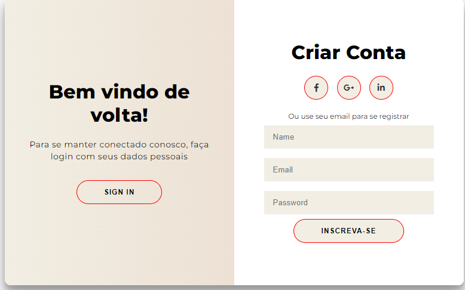

<h1> align="center"> DevHouse Project </h1>
<h4> align="center">  https://andradeelton.github.io/projeto2/ </h4>

 align="center">
Desafio Proposto por um grupo de amigos desenvolvedores.

 align="center">
  <a href="#-tecnologias">Tecnologias</a>&nbsp;&nbsp;&nbsp;|&nbsp;&nbsp;&nbsp;
  <a href="#-projeto">Projeto</a>&nbsp;&nbsp;&nbsp;|&nbsp;&nbsp;&nbsp;
  <a href="#-layout">Layout</a>&nbsp;&nbsp;&nbsp;|&nbsp;&nbsp;&nbsp;
  <a href="#memo-licença">Licença</a>

 align="center">
  

 

 align="center">
  

## 🚀 Tecnologias

Esse projeto foi desenvolvido com as seguintes tecnologias:

- HTML e CSS
- JavaScript
- Git e Github

## 💻 Projeto

DevHouse projeto para criação de portfólio pessoal.

## :memo: Licença

Esse projeto está sob a licença MIT.

---

Feito com ♥ 

